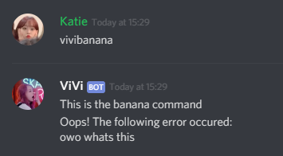

# Haseul
Express style bot framework

## Installation
```bash
yarn add haseul
# npm i --save haseul
```

## Usage

### new Haseul();
Creates a new router.

```js
// dumb dumb require.js imports
const Haseul = require('haseul');

// New fancy imports
import Haseul from 'haseul';

// Create a new Haseul.
const router = new Haseul();
```

### router.route(content, message)
Executes the router.
Pass in the raw message next, and pass in the object.

### router.set(name, value)
Sets the setting `name` as `value`.
You can store anything you like, but some control the behaviour of the server.

name   | default value | action
------ | ------------- | -------------
prefix | ''            | Sets the prefix of the router

### router.command([command, ] callback)
Creates a command.
The command executes if the user's text matches `command`, or if `command` is empty.

The callback is given an object with the following properties:

name    | description
------- | -----------
message | The original object handed in from `router.route(content, message)`
next    | A function which executes the next available command. Use `next(error)` to pass an error to the next available `route.error` handler.

### router.command([command, ] router)
Creates a command with subcommands.
Try not to use this yet.

### router.error([command, ] callback)
Creates an error handler.
The error executes if the user's text matches `command`, or if `command` is empty.

The callback is given an object with the following properties:

name    | description
------- | -----------
message | The original object handed in from `router.route(content, message)`
err     | The error passed in.
next    | A function which executes the next available command. Use `next(error)` to pass an error to the next available `route.error` handler.

## Example with Eris
```js
import Eris from 'eris';
import Haseul from 'haseul';

const bot = new Eris('token')
const router = new Haseul();
const deeperRouter = new Haseul();

bot.on('messageCreate', (message) => {
  router.route(message.content, message);
})

router
  .set('prefix', 'vivi')
  .command('help', ({message}) => {
    message.channel.createMessage('This is the help command');
  })
  .command('banana', ({message, next}) => {
    message.channel.createMessage('This is the banana command');
    next(new Error('owo whats this'))
  })
  .command('hello', deeperRouter)
  .error(({message, err}) => {
    message.channel.createMessage(`Oops! The following error occurred:\n${err.message}`)
  })

deeperRouter
  .command('world', ({message}) => {
    message.channel.createMessage('Test2');
  })
```



## Notes
- [You may be interested in this music video](https://www.youtube.com/watch?v=6a4BWpBJppI)
- This project is licenced under the MIT licence
