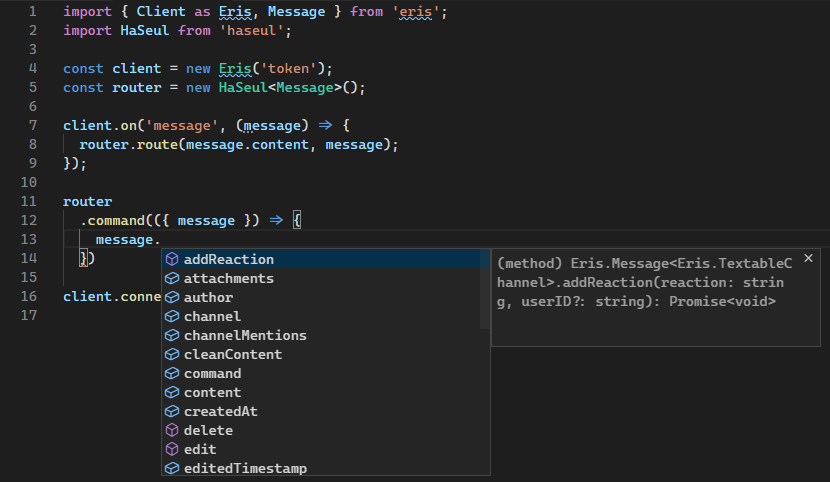

# HaSeul Bot Framework
A Node.js command handler, inspired by Express.js

`npm install --add haseul`


## Links
- [Documentation](https://haseul.leondrolio.com/)
- [npm](https://www.npmjs.com/package/haseul)
- [ViVi](https://github.com/botsto/vivi)

## Notes
- [You may be interested in this music video](https://www.youtube.com/watch?v=6a4BWpBJppI)
- This project is licenced under the MIT licence

## Getting Started
### Importing
In order to use HaSeul, you can either use CommonJS to import HaSeul, or use ES6 modules.
```javascript
// CommonJS
const HaSeul = require('haseul').default;

// ES6
import Haseul from 'haseul';
```

## Creating a Router
You can then create a new instance of HaSeul.
```javascript
const router = new HaSeul();
```

## TypeScript
If you're combining HaSeul with other libraries such as Eris or Discord.js, you may want to pass the Message class as a type into HaSeul.
```typescript
import { Message } from 'eris';
import HaSeul from 'haseul';

const router = new HaSeul<Message>();
```

This allows for better type information.



## Examples
### JavaScript Discord.js Example
```javascript
const Discord = require('discord.js');
const HaSeul = require('haseul').default;

const client = new Discord.Client();
const router = new HaSeul();
let counter = 0;

// When a message arrives...
client.on('message', (message) => {
  // Put it through the HaSeul routing engine.
  router.route(message.content, message);
});

// Define the routes that HaSeul will handle
router
  .command('help', ({ message }) => {
    message.reply('You ran the help command!');
  })
  .command('counter', ({ message }) => {
    counter += 1;
    message.reply(`This command has been ran ${counter} times!`);
  })

client.login('token');
```

### TypeScript Eris Error Handling Example
```typescript
import { Client as Eris, Message } from 'eris';
import HaSeul from 'haseul';

const client = new Eris('token');
const router = new HaSeul<Message>();

// When a message arrives...
client.on('message', (message) => {
  // Put it through the HaSeul routing engine.
  router.route(message.content, message);
});

// Define the routes that HaSeul will handle
router
  .command('yeojin', ({ next }) => {
    try {
      // Do something that causes an error!
    } catch(e) {
      // Throw the error into the `next` function
      next(e);
    }
  })
  .error(({ err, message }) => {
    message.channel.createMessage('An error occurred while processing your request: ' + err.stack)
  })

client.connect();
```
